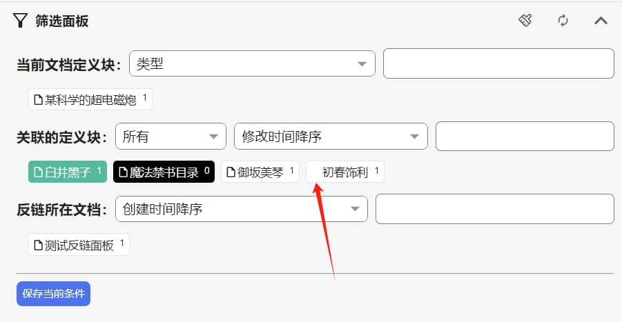
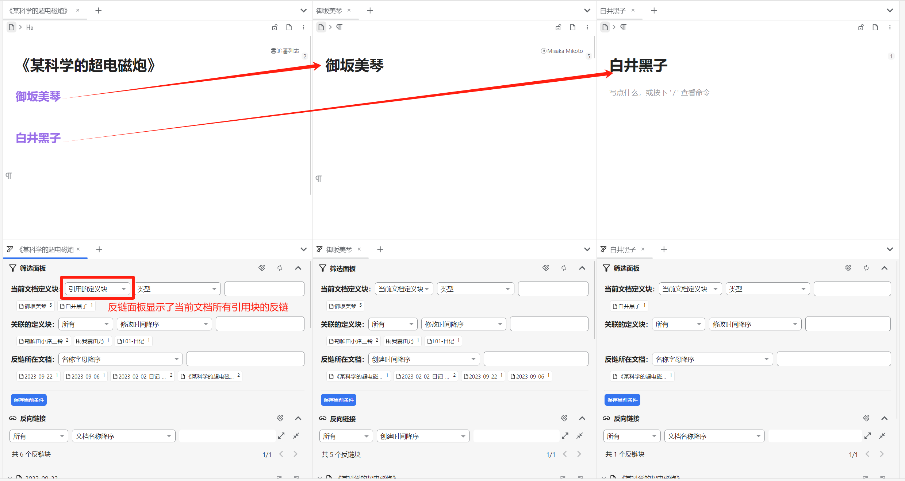
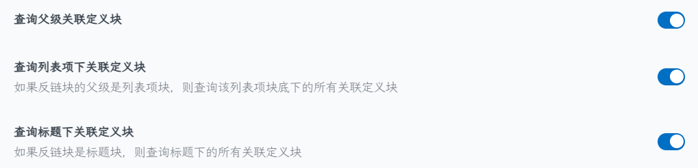
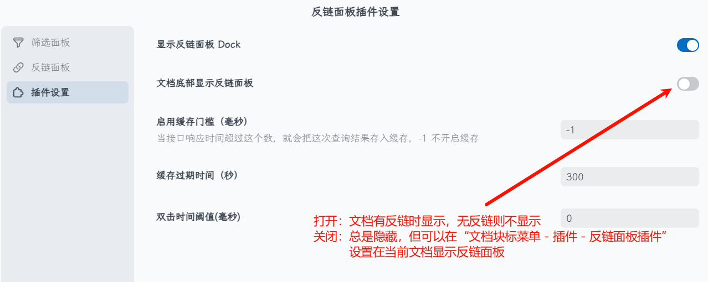
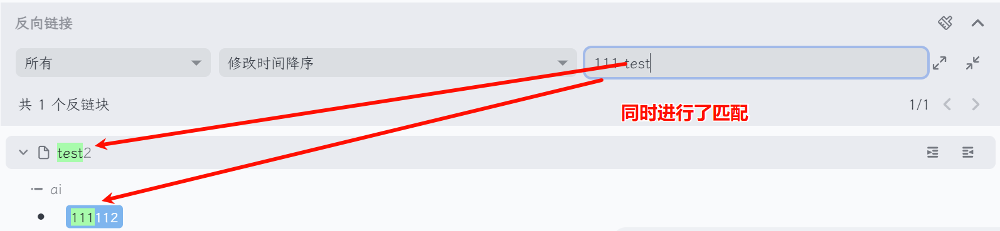
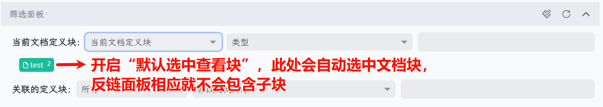

## Concepts

This plugin uses the following concepts. For example: Block A references Block B in Document 1 and Block C in Document 2. When you open Document 1 (which contains B) to view backlinks:

* Definition block: the referenced content block inside Document 1, i.e., Block B.
* Backlink block: the block that references the definition block, i.e., Block A.
* Related definition block: blocks from other documents that are referenced along the backlink block's path/parent path/child path, i.e., Block C.

## Feature Overview

Note: Most features are WYSIWYG. The sections below follow the three main areas in the plugin settings.

### (1) Overall Surfaces

This plugin provides:

* Backlinks at the bottom of the document
* Dock sidebar
* Custom tab pane

The first two can be toggled in the plugin settings. The custom tab has a button in the top bar.

### (2) Filter Panel

* Anchor text selection states in the filter panel:

  

  * Green: included definition block
  * Black: excluded definition block (the number at the top-right should always be 0; if not, it indicates a bug)
  * White: unselected

  Note: If a definition block lacks a block icon (as indicated by the arrow in the screenshot), it means the block the definition points to does not exist (possibly deleted).

* Interactions on anchor text in the filter panel:

  * Desktop:
    * Include: left-click the anchor text
    * Exclude: <kbd>Shift + click</kbd>, right-click, or double-click (requires setting a double-click interval first)
  * Mobile:
    * Include: tap the anchor text
    * Exclude: long-press the anchor text

* As the names suggest, both "Current document definition blocks" and "Related definition blocks" display the text content of definition blocks, not the anchor text itself.

* `Current document definition blocks`: used to aggregate backlinks distributed across definition blocks in the current document. It includes:
  1. Current document definition blocks: content blocks in this document that are referenced elsewhere
  2. Referenced definitions in other documents: when this document references other blocks, selecting this option shows the backlinks of all those referenced definition blocks

    

* `Related definition blocks`: for the selected current-document definition blocks, these are definition blocks from other documents that appear in the backlink content.

  * You can adjust the scope of related definition blocks in settings.
    Explanation: If you enable "Query parent related definition blocks" in the plugin settings, then all definition blocks referenced along the backlink block's parent path will also appear in the filter panel.

    

  * You can filter by "static anchor text" and "dynamic anchor text". Hovering a static anchor shows both the anchor text and the definition block's text content.
  * The search here can match both the anchor text and the referenced content.

* `Backlink document`:

  Sort and filter the document blocks where backlink blocks appear. Currently, only one document can be selected at a time (no multi-select).

### (3) Backlink Panel

Note: "Backlink panel" here refers to the area showing backlink blocks.

* The display logic differs from the official panel: the official one groups/sorts by documents containing backlinks; this plugin displays and sorts by the backlink blocks themselves.
* Regarding the bottom-of-document backlinks setting:

  

  In addition to the global toggle, you can control it per document. Use `Document title icon → Plugins → Filterable Backlink Panel` to set it quickly. Internally this adds a custom attribute `document-bottom-show-backlink-filter-panel` to toggle whether the bottom backlink area is shown for that document:

  1. Reset to default: remove the custom attribute; the document follows the global plugin setting
  2. Always show bottom backlinks: set the attribute value to `1`; the document shows the bottom panel regardless of the global setting
  3. Always hide bottom backlinks: set the attribute value to `-1`; the document hides the bottom panel regardless of the global setting

* Backlink panel search:

  * Supports searching document names; you can combine document name + keywords within backlink blocks.

    

  * Search box syntax: `%` matches anchor text; `-` excludes content; `-%` or `%-` excludes anchor text. These can be combined.

    | Prefix | Content | Anchor text |
    | ------ | ------- | ----------- |
    | Filter | none    | `%`         |
    | Include| space   | space       |
    | Exclude| `-`     | `%-` or `-%`|

    Note: "Content" means all textual content of the backlink block (including the name of the document where the backlink resides). "Anchor text" refers only to the text used as block-reference anchors (static or dynamic). Therefore, content includes anchor text.

  * When searching in the backlink panel, the selectable ranges in the filter panel update accordingly.
* <kbd>Ctrl + click</kbd> the document name/breadcrumb in the backlink area to open that document (same as the official backlink panel behavior).

### (4) Other Tips

* Sorting by time for definition blocks is based on the time of the backlink block in which they appear.
* "Save current criteria" is supported. It saves all conditions from both the filter panel and the backlink panel.
* If you enable `Filter panel → Default select view block` in the plugin settings, the filter panel will preselect the document block, similar to disabling "Backlinks include sub-blocks" in SiYuan settings:

  

